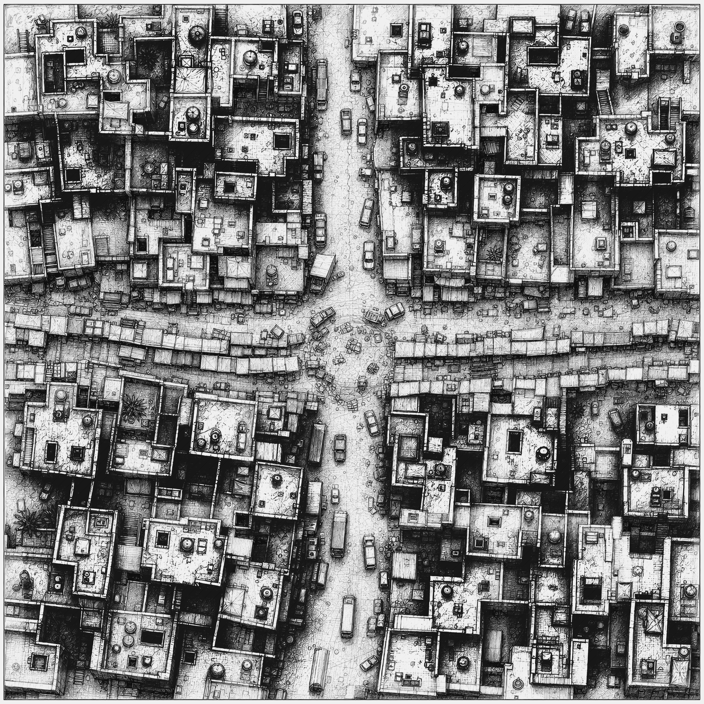
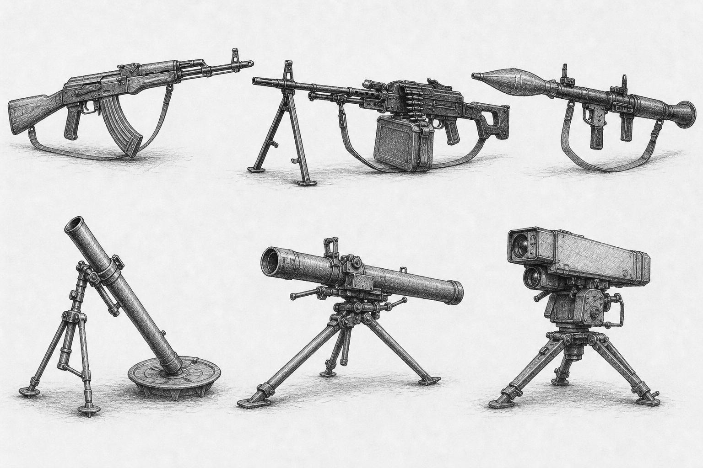
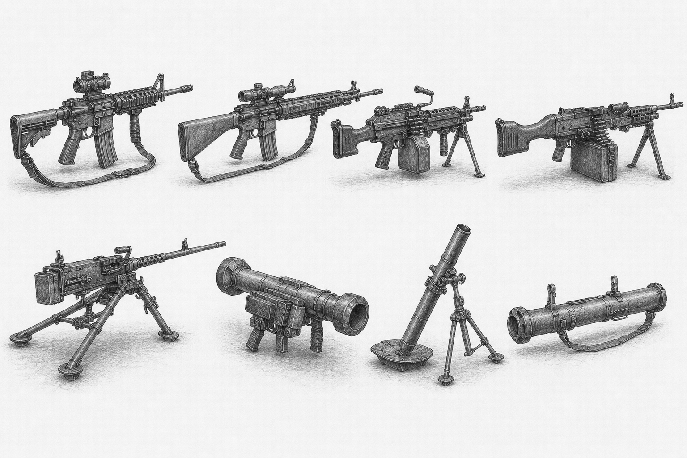
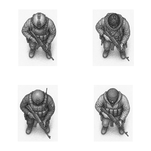
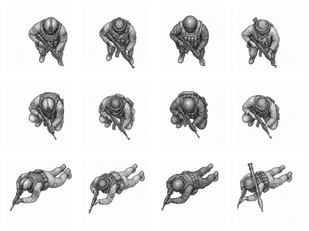
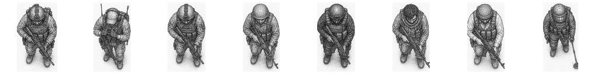

# MOSUL

`mosul` is the public Mac SwiftUI interface and project home for a tactical war game and playable demo set in Mosul, Iraq. The first demo target is the 2003 Market / Commercial Streets scenario: a tense post-invasion urban security fight built around patrols, checkpoints, shopfronts, rooftops, civilians, looting pressure, raids, hidden weapons, and sudden close-range contact.

The aim is not to make a generic arena shooter with a Mosul label. The project is about a city: streets, roofs, courtyards, alleys, civic buildings, market lanes, civilians, military uncertainty, and the uncomfortable transition from battlefield victory to public security.

## Current Demo

The initial playable scenario is centered on the 2003 U.S. presence in Mosul after the city fell during Operation Iraqi Freedom. The baseline allied identity is U.S. Army conventional infantry associated with the 101st Airborne Division period in Mosul, with local security problems and early disorder rather than the later 2016-2017 ISIS siege model.

The demo combat space is a `500 m x 500 m` Market / Commercial Streets cluster. The current source overview is a `7,000 px x 7,000 px` black-and-white line-art map, about `14 px` per meter, with the full combat art target still expected to scale toward about `70 px` per meter.



The map is designed for multi-layer play. Ground streets, courtyards, shopfronts, and building interiors need to coexist with rooftop movement, upper-floor fire, stair access, breach points, rubble, blocked roads, and changing cover. The engine work is expected to support streamed map tiles rather than one enormous always-loaded bitmap.

The current engine scenario now loads from validated data in the `modernerKrieg` submodule instead of only from hard-coded C fixtures. The first public scenario file is:

```text
modernerKrieg/game/mosul/scenarios/market_commercial_streets_2003.mkscenario
```

The matching map, sprite, and marker manifests are also present under:

```text
modernerKrieg/assets/mosul/manifests/
```

The native Mac demo is now present in this repository as `Mosul.xcodeproj`. It is a thin SwiftUI app over the `modernerKrieg` C core: SwiftUI handles presentation and input, a small C bridge exposes the current scenario state to Swift, and the simulation, AI, scenario data, manifest parsing, and PNG runtime assets remain in the submodule.

The current Mac app renders the runtime Market / Commercial Streets overview PNG from `modernerKrieg/assets/mosul/runtime/`, overlays C-core units, objectives, civilians, and contact reports, and provides basic controls for selection, movement, investigation orders, single-step simulation, reset, and deterministic AI ticks.

The Mac app also includes the codenamed `snapshot` path for visual testing. The Snapshot command renders the current tactical map to timestamped PNG files in the local `snapshots/` directory, which is ignored by git, so interesting battle states and civilian-risk moments can be kept as throwaway visual evidence during development.

## Tactical Identity

MOSUL is commanded at unit scale, but it should preserve meaningful detail inside units. A squad should not be just one counter with a hit point number. Soldiers need roles, weapons, ammo, wounds, suppression, stance, exposure, and equipment. A medic, breacher, automatic rifleman, marksman, squad leader, vehicle crew, or RPG gunner should change the tactical problem.

The first demo side lists are intentionally compact:

- U.S. / coalition / local security: rifleman, squad leader, automatic rifleman, grenadier, marksman, medic, engineer / breacher, and Humvee / vehicle crew.
- Regime remnant / disorder / early insurgent force: rifleman, irregular fighter, cell rifleman, RPG gunner, machine gunner, sniper / marksman, mortar or rocket harassment cell, and weapons looter / armed criminal.


Combat should be about more than direct fire. The important systems are line of sight, suppression, morale, casualties, civilian risk, rooftop access, breach/entry actions, hidden defenders, IED suspicion, vehicle vulnerability, smoke, rubble, route clearance, medical recovery, and whether a cleared street stays cleared.


## Weapons And Vehicles

The 2003 demo starts with a restrained weapons set: rifles, carbines, squad automatic weapons, grenade launchers, machine guns, RPGs, marksman rifles, mortars or off-map harassment, vehicle weapons, smoke, and breaching tools. Heavy support should matter, but it should not erase the urban problem.





Vehicles are tactical tools rather than scenery. Humvees, trucks, armored vehicles, technicals, engineering vehicles, and air-support markers all need to interact with streets, rubble, rooftops, ambush angles, civilian movement, and extraction routes.


## Art Direction

All public presentation art should stay in contemporary black-and-white graphite line art: dense drafted linework, varied stroke weight, hatching, realistic silhouettes, and believable tactical detail. Stick figures, stick weapons, bare schematic blocks, and placeholder programmer art do not belong in public graphics.


The top-down sprites are also line-art assets. The current tactical scale uses `128 x 128` combatant cells. Movement and casualty states should be represented through body position and silhouette: standing, crouch, prone, wounded, and dead, with renderer flips deriving additional facings where possible.





Civilian sprites are part of the tactical system rather than background decoration. The current non-combatant set includes old man, old woman, adult woman, teenage boy, teenage girl, young girl, and young boy archetypes, each with standing, wounded, and dead non-graphic body states plus eight runtime facings.





The `modernerKrieg` submodule now includes a larger runtime asset base: complete source-angle infantry, civilian, weapon, and vehicle sprites, 1,064 rendered runtime-facing PNGs, a runtime map overview for the Market / Commercial Streets scenario, and validated C-readable manifests for map, sprite, and marker metadata. Source art remains preserved separately from generated/runtime assets.

## Engine Direction

The engine work lives in the `modernerKrieg` submodule. It is now a portable C + CMake tactical engine with validated data loading, asset-manifest parsing, deterministic AI/autoplay tools, replay validation, renderer-independent board projection, and PNG-backed runtime asset handoff for native frontends.

See [PLAN.md](PLAN.md) for the playable-demo development plan.

The SDL experiment has been removed from the active engine path. Launchable interfaces should now be platform-native shells over the same portable C libraries. The Mac shell lives here in `mosul`; `modernerKrieg` remains the owner of all C core behavior, loaders, manifests, command-line tools, replay validation, and runtime PNG assets. The command-line tools remain the deterministic testing, replay, and balancing surface.

To inspect or build the engine:

```sh
git submodule update --init --recursive
cd modernerKrieg
cmake --preset headless
cmake --build --preset headless
ctest --preset headless
```

Run the current headless smoke scenario:

```sh
./build/headless/bin/mk_headless_run --steps 10
```

Run both tactical sides under deterministic AI:

```sh
./build/headless/bin/mk_headless_run --ai-only --max-ticks 10
```

Write and validate a deterministic replay:

```sh
./build/headless/bin/mk_headless_run \
  --ai-only \
  --max-ticks 10 \
  --quiet \
  --replay build/headless/mosul_ai.mkreplay

./build/headless/bin/mk_replay_validate \
  --expect-result MK_OK \
  build/headless/mosul_ai.mkreplay
```

The current headless CTest suite validates the portable core, board-view projection, fixed loop, AI behavior, asset manifests, scenario data, headless runs, replay output, balance checks, and core/frontend boundary.

## Mac App

The Mac app source is kept in `mosul`, not in `modernerKrieg`:

- `Mosul.xcodeproj`: Xcode project for the native Mac demo.
- `Mac/Mosul/App/`: SwiftUI app, map view, controls, and inspector panels.
- `Mac/Mosul/Bridge/`: C bridge between Swift and the `modernerKrieg` headers.
- `Mac/README.md`: Mac-specific build notes.

Open the project from the repository root:

```sh
open Mosul.xcodeproj
```

Or build the current debug app from Terminal:

```sh
xcodebuild -project Mosul.xcodeproj \
  -scheme Mosul \
  -configuration Debug \
  -derivedDataPath build/MosulDerivedData \
  build
```

The app expects the submodule at `mosul/modernerKrieg`. It loads the current `.mkscenario` file, map manifest, and runtime overview PNG directly from that submodule during development, so PNG files and loaders do not need to be copied into the Mac app tree.

## Development Legacy

MOSUL follows lessons from earlier work rather than starting from a blank page. `guderian` and its included `derZweiteWeltkrieg` engine provide useful design memory: deterministic C rules, headless tests, a thin presentation layer, scenario boards, morale, movement, fire, objectives, and a practical SwiftUI app path.

MOSUL is not a reskin of a World War II system. Modern Mosul needs its own rules for civilians, asymmetric threats, rooftop movement, hidden positions, drones, IED suspicion, civilian-harm scoring, vehicle exposure, breach actions, and post-combat security. The legacy is engineering discipline, not era reuse.


## Repository Shape

```text
mosul/
  Mosul.xcodeproj/            native Mac demo project
  README.md
  Mac/                        SwiftUI app and C bridge
  assets/readme/              public README artwork
  modernerKrieg/              tactical engine, data, tools, and runtime assets
```

Important `modernerKrieg` paths:

- `engine/core/`: portable simulation, rules, state, scoring, and replay-facing data.
- `engine/render/`: renderer-independent board and overlay projection.
- `engine/assets/`: portable map, sprite, and marker manifest parsing/validation.
- `engine/ai/`: deterministic controller policies that emit normal core orders.
- `engine/tools/autoplay/`: headless run, replay validation/playback, and AI-vs-AI tools.
- `game/mosul/scenarios/`: validated Mosul scenario data.
- `assets/mosul/source/`: unmodified source art and map assets.
- `assets/mosul/runtime/`: generated or copied runtime products, including the current map overview and rendered sprites.
- `assets/mosul/manifests/`: map, sprite, and marker manifests validated by C tests.

Source art should remain unmodified. Engine-ready sprites, atlases, tiles, collision data, and runtime map products should be generated from source assets rather than edited directly in place.

## Public Discussion

The public face of development is the Guderian Discord server:

[Join the Guderian Discord server](https://discord.gg/FzyszZFS2c)

Interested users, testers, artists, historians, engineers, and potential developers can also contact:

`barbalet at gmail dot com`

## License

See [LICENSE](LICENSE).
