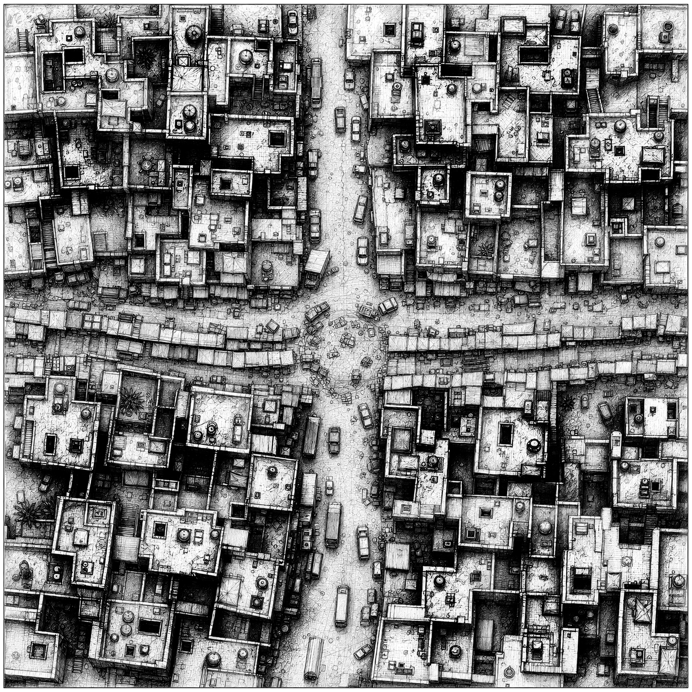

# MOSUL

`mosul` is the public home for a tactical war game and playable demo set in Mosul, Iraq. The first demo target is the 2003 Market / Commercial Streets scenario: a tense post-invasion urban security fight built around patrols, checkpoints, shopfronts, rooftops, civilians, looting pressure, raids, hidden weapons, and sudden close-range contact.



The aim is not to make a generic arena shooter with a Mosul label. The project is about a city: streets, roofs, courtyards, alleys, civic buildings, market lanes, civilians, military uncertainty, and the uncomfortable transition from battlefield victory to public security.

## Current Demo

The initial playable scenario is centered on the 2003 U.S. presence in Mosul after the city fell during Operation Iraqi Freedom. The baseline allied identity is U.S. Army conventional infantry associated with the 101st Airborne Division period in Mosul, with local security problems and early disorder rather than the later 2016-2017 ISIS siege model.

The demo combat space is a `500 m x 500 m` Market / Commercial Streets cluster. The current source overview is a `7,000 px x 7,000 px` black-and-white line-art map, about `14 px` per meter, with the full combat art target still expected to scale toward about `70 px` per meter.


The map is designed for multi-layer play. Ground streets, courtyards, shopfronts, and building interiors need to coexist with rooftop movement, upper-floor fire, stair access, breach points, rubble, blocked roads, and changing cover. The engine work is expected to support streamed map tiles rather than one enormous always-loaded bitmap.

## Tactical Identity

MOSUL is commanded at unit scale, but it should preserve meaningful detail inside units. A squad should not be just one counter with a hit point number. Soldiers need roles, weapons, ammo, wounds, suppression, stance, exposure, and equipment. A medic, breacher, automatic rifleman, marksman, squad leader, vehicle crew, or RPG gunner should change the tactical problem.

The first demo side lists are intentionally compact:

- U.S. / coalition / local security: rifleman, squad leader, automatic rifleman, grenadier, marksman, medic, engineer / breacher, and Humvee / vehicle crew.
- Regime remnant / disorder / early insurgent force: rifleman, irregular fighter, cell rifleman, RPG gunner, machine gunner, sniper / marksman, mortar or rocket harassment cell, and weapons looter / armed criminal.


Combat should be about more than direct fire. The important systems are line of sight, suppression, morale, casualties, civilian risk, rooftop access, breach/entry actions, hidden defenders, IED suspicion, vehicle vulnerability, smoke, rubble, route clearance, medical recovery, and whether a cleared street stays cleared.


## Weapons And Vehicles

The 2003 demo starts with a restrained weapons set: rifles, carbines, squad automatic weapons, grenade launchers, machine guns, RPGs, marksman rifles, mortars or off-map harassment, vehicle weapons, smoke, and breaching tools. Heavy support should matter, but it should not erase the urban problem.


Vehicles are tactical tools rather than scenery. Humvees, trucks, armored vehicles, technicals, engineering vehicles, and air-support markers all need to interact with streets, rubble, rooftops, ambush angles, civilian movement, and extraction routes.


## Art Direction

All public presentation art should stay in contemporary black-and-white graphite line art: dense drafted linework, varied stroke weight, hatching, realistic silhouettes, and believable tactical detail. Stick figures, stick weapons, bare schematic blocks, and placeholder programmer art do not belong in public graphics.


The top-down sprites are also line-art assets. The current tactical scale uses `128 x 128` combatant cells. Movement and casualty states should be represented through body position and silhouette: standing, crouch, prone, wounded, and dead, with renderer flips deriving additional facings where possible.


## Engine Direction

The engine work lives in the `modernerKrieg` submodule. It is a fresh tactical engine for MOSUL, with a portable C simulation core, CMake build, deterministic tests, renderer-independent board logic, and an experimental SDL3 application shell.

SDL3 is still an open question. If it proves workable for the desired game feel and deployment path, MOSUL will use it. If it does not, the contingency is a new SwiftUI GUI around the same underlying tactical model, following lessons learned from the existing macOS work in `guderian`.

To inspect or build the engine:

```sh
git submodule update --init --recursive
cd modernerKrieg
cmake -S . -B build
cmake --build build
ctest --test-dir build --output-on-failure
```

If SDL3 is available, CMake can build the optional app target. If SDL3 is not available, the portable core and tests should still build.

## Development Legacy

MOSUL follows lessons from earlier work rather than starting from a blank page. `guderian` and its included `derZweiteWeltkrieg` engine provide useful design memory: deterministic C rules, headless tests, a thin presentation layer, scenario boards, morale, movement, fire, objectives, and a practical SwiftUI app path.

MOSUL is not a reskin of a World War II system. Modern Mosul needs its own rules for civilians, asymmetric threats, rooftop movement, hidden positions, drones, IED suspicion, civilian-harm scoring, vehicle exposure, breach actions, and post-combat security. The legacy is engineering discipline, not era reuse.


## Repository Shape

```text
mosul/
  README.md
  assets/readme/              public README artwork
  modernerKrieg/              tactical engine and Mosul source assets
```

`modernerKrieg/assets/mosul/source/` contains the source art and map assets currently selected for the 2003 demo. Engine-ready sprites, atlases, tiles, collision data, and runtime map products should be generated from source assets rather than edited directly in place.

## Public Discussion

The public face of development is the Guderian Discord server:

[Join the Guderian Discord server](https://discord.gg/FzyszZFS2c)

Interested users, testers, artists, historians, engineers, and potential developers can also contact:

`barbalet at gmail dot com`

## License

See [LICENSE](LICENSE).
